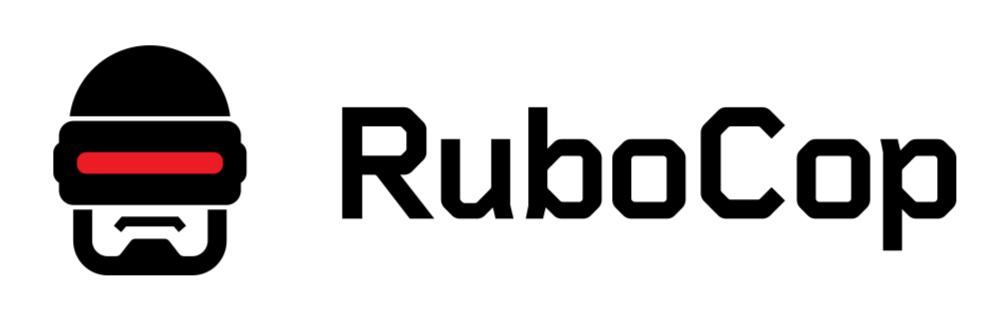

# A Framework for Tech. Debt

theme
:   baltic-ruby

allotted-time
:   35m

{::comment}
Thank you for having me, let's talk about our all least favorite topic: Tech.
Debt.
{:/comment}

# Introduction

> Technical Debt

{::comment}
The term expands to technical debt. If you are not familiar with the term,
it describes problems in software that are not solved, or not solved
properly. There are many forms of this technical debt, I put some together
and quickly ended up with too many.
{:/comment}

# Introduction

{:relative_height="95"}

{::comment}
There is many forms of this, we have it with not updating the libraries our
software depends on, ending up with outdated dependencies.

We have it with decisions we had to make in the past, that no longer support
our current needs. Note, that this is not a bad thing. At the time you made
the previous decision, you likely put a lot of effort into finding the right
solution and picked the best on available. However, over time, things change.

Exploring the different kind of tech. debt can be a good exercise, but we want
to focus on a practical framework to tackle it.
{:/comment}

# Introduction

> Debt

{::comment}
When it comes to me...  I don't like the term cause debt means someone owes
money or something else to some other party. Like in borrowing something from
someone else. Think of loan from a bank for a house.

However, fellow colleague Martin told me in a discussion that he likes the term
as it points out that over time, this debt increases so it's a good thing to
take care of it, earlier the better.
{:/comment}

# Introduction

{:relative_height="95"}

{::comment}
Visual representation: Gets more expensive over time. Think of a dependency,
the longer we wait to update, the harder it gets.
{:/comment}

# Introduction

> Software Rot

{::comment}
In literature you often find the term described as software rotting away. This
explicitly points out that it is a natural process. Compared to tech. debt.
it misses to express that it is a growing problem.
{:/comment}

# Introduction

> Business Risk

{::comment}
Talking about problems, some people refer to tech. debt. as business risk. That
is very interesting as it emphasizes why we even care about it.
{:/comment}

# Me

👴️ 2+ Decades in Software Development
📚️ Complete Stack
🛠️ Staff @ Meister

{:relative_height="90" relative_margin_left="10"}

{::comment}
- Two decades in professional development and several more years in academia.
- Complete Stack Developer: Frontend, Backend, DevOps, Cli Tools, Management
- The last two years at Meister, I joined in early 2023
{:/comment}

# Working at Meister

> The Siblings of Meister

{:relative_width="80"}

{::comment}
Shopify 2006 | Meister 2007 | GitHub 2008

Talking about Meister, you might know it all started in 2007, in comparison
other software from that time that share the technical foundation are GitHub
and Shopify. That's great names and it's impressive for a software to be
successful for such a long period and keep technical competence to high quality
as well as to remain with a modern tech stack.
{:/comment}

# Practical Example

> You join a project as seniored developer...

{::comment}
In our fictional, practical example...
{:/comment}

# Practical Example

✅️ check README.md
✅️ check Gemfile
✅️ explore some tests
✅️ explore some code
✅️ check testsuite passes (in CI 🙏️)
❌️ check RuboCop

{::comment}
...steps you take when joining a new project
{:/comment}

# Practical Example

{:relative_width="95"}

{::comment}
May I ask: Who knows RuboCop?
If you don't know, it's a static code analyzer for Ruby. Think of it as a tool
you run to check on your code and it tells you about best practices on Ruby
community standards, on security, on performance, on software quality and more.

May I ask: Who uses RuboCop? At work, or in personal projects?

It is one of the greatest tools and I'm so happy that it exists in the Ruby
community and that its maintainers keep that great work for ever since.
{:/comment}

# Practical Example

> ❌️ check RuboCop

{::comment}
So the tool doesn't pass, but luckily, there's a feature it ships with, that
let you create a "todo" file. This file contains all the files that currently
do not pass certain rules so you can ignore them for now.
{:/comment}

# Practical Example

```sh
$ cat .rubocop_todo.yml
# Offense count: 1
Lint/DuplicateBranch:
  Exclude:
    - app/model/team.rb
# Offense count: 8
Metrics/MethodLength:
  Exclude:
    - app/controllers/teams_controller.rb
    - app/model/team.rb
```

{::comment}
{:/comment}

# Practical Example

> ✅️ check RuboCop

{::comment}
now passes, ignores legacy violations
{:/comment}

# Practical Example

```bash
$ wc -l .rubocop_todo.yml
1145 .rubocop_todo.yml # 1145 lines in file
```

{::comment}
word count with argument `-l` newlines
{:/comment}

# Practical Example

> How can we get rid of the TODOs? 🤔️

{::comment}
{:/comment}

# A Framework for Tech. Debt

> Four Steps Framework

{::comment}
over time, formed a framework that helps
{:/comment}

# A Framework for Tech. Debt

**1. Get the Numbers** 📝️

# A Framework for Tech. Debt

```sh
# total number of lines
$ wc -l .rubocop_todo.yml
```

# A Framework for Tech. Debt

```sh
$ cat .rubocop_todo.yml
# Offense count: 1
Lint/DuplicateBranch:
  Exclude:
    - app/model/team.rb
```

# A Framework for Tech. Debt

```sh
$ grep 'Offense count:' .rubocop_todo.yml
Offense count: 1
Offense count: 4
Offense count: 2
Offense count: 28
# [...]

# extract number of rules violated
$ grep 'Offense count:' .rubocop_todo.yml | wc -l
```

{::comment}
grep ... global regular expression print
{:/comment}

# A Framework for Tech. Debt

```sh
# extract number of violations
$ grep 'Offense count:' .rubocop_todo.yml | \
    ruby -e 'puts $stdin.readlines.sum { it.split.last.to_i }'
```

# A Framework for Tech. Debt

**1. Get the Numbers** ✅️

...and store them away

{::comment}
{:/comment}

# A Framework for Tech. Debt

> Store in Database 🙄️

# A Framework for Tech. Debt

> Create a File per Day in a Bucket 📆️

# A Frameowk for Tech. Debt

```ruby
# lib/tasks/tech_debt.rake
namespace :tech_debt do
  desc 'Record development metrics'
  task metrics: :environment do
    total_lines = `wc -l .rubocop_todo.yml`.strip.split.first.to_i
    File.write("tmp/#{Date.today}.json", { total_lines: }.to_json)
  end
end
```

{::comment}
{:/comment}

# A Framework for Tech. Debt

```sh
$ cat data/2025-06-23.json
{
  "rubocop": {
    "total_lines_of_todo_file": 1145,
    "number_of_rules_violated": 74,
    "number_of_violations": 2128
  }
}
```

{::comment}
{:/comment}

# A Framework for Tech. Debt

**1. Get the Numbers** ✅️

**2. Visualize Numbers** 📝️

{::comment}
{:/comment}

# A Framework for Tech. Debt

{:relative_height="90"}

{::comment}
{:/comment}

# A Framework for Tech. Debt

{:relative_height="90"}

{::comment}
A reminder how debt works.
{:/comment}

# A Framework for Tech. Debt

{:relative_height="90"}

{::comment}
What we want, is burn down.
{:/comment}

# A Framework for Tech. Debt

**1. Get the Numbers** ✅️

**2. Visualize Numbers** ✅️

**3. Create a Vision** 📝️

{::comment}
That's something we need to understand clearly. Reversing the problem statement
and have a vision of how our daily life and our work looks like after we got
rid of that one particular thing.
{:/comment}

# A Framework for Tech. Debt

> Vision for RuboCop
>
> ✅️ Good Practice

# A Framework for Tech. Debt

Benefits 💪️
    * Ruby Practice & Learning
    * Readability
    * Consistency
    * Collaboration
    * Maintainablility
    * Code Complexity
    * Performance
    * Security

{:relative_width="50" align="right"}

{::comment}
...
{:/comment}

# A Framework for Tech. Debt

> Vision for RuboCop
>
> ✅️ Good Practice
> 🌞️ Less Problems

# A Framework for Tech. Debt

> Vision for RuboCop
>
> ✅️ Good Practice
> 🌞️ Less Problems
> 🌴️ Easy Changes

{::comment}
Allows you to understand the problem, but also the benefits of what you solve
with it. A vision is: In two years from now, we'll have a codebase with no
Rubocop violations. That includes: Community Best Practices, Better Code Quality
by Having good Metrics, Less Code Smells, Less Security Concerns.

Gradual fixes, Burn down of Tech. Debt
{:/comment}

# A Framework for Tech. Debt

**1. Get the Numbers** ✅️

**2. Visualize Numbers** ✅️

**3. Create a Vision** ✅️

**4. Make Steps Towards the Vision** 📝️


# A Framework for Tech. Debt

{:relative_height="90"}

{::comment}
What I mean is, although we strive to resolve everything. Making that burndown
chart go down.
{:/comment}

# A Framework for Tech. Debt

**Extend our Playbook:**

📝️ On Additions: Accept No Violations.
📝️ On Changes: Refactor When Possible.

{::comment}
What if we introduce rules on how we work.
{:/comment}

# A Framework for Tech. Debt

{:relative_height="90"}

{::comment}
However, a reminder how debt works.
{:/comment}

# A Framework for Tech. Debt

> "We don't need to **fix** everything."

# A Framework for Tech. Debt

**1. Get the Numbers** ✅️

**2. Visualize Numbers** ✅️

**3. Create a Vision** ✅️

**4. Make Steps Towards the Vision** ✅️

# Applications of the Framework

> Impact on Communication

{::comment}
{:/comment}

# Applications of the Framework

> Technical Debt
> for *Developers*

{::comment}
Tech. Debt: Talking with developers what needs to be tackled. Create the
awareness that things get harder to fix the longer we wait. We now have a
vision, we have an idea of the problem by the numbers, we know steps to take
towards the vision.

In a different perspective, this also means we can ensure that new code always
fulfills criteria of our vision. We can also ensure this whenever we touch
existing code although we explicitly don't have to. We have improvements
reflected by the numbers and can celebrate success. Remember that a
characteristic of debt is that things get worse, that means no change is an
improvement.
{:/comment}

# Applications of the Framework

> Software Rot
> for *Technical* and
> *Non-Technical People*

{::comment}
Software Rot: Talking with management, or business people to emphasize that
this is a natural process. It's no ones fault. Point to the prime directive
of retrospective. Decisions have been made in the best of our knowledge and
adapted to what was needed and resources available at that time.
{:/comment}

# Applications of the Framework

> Business Risk
> for
> *Non-Technical People*

{::comment}
Business Risk: Whenever planning comes up it can be good to work with risk.
Having the numbers is helpful now as we also can talk about what does it take,
and what are the benefits having it resolved. Later is empowered by the vision
that we have build.
{:/comment}

# Applications of the Framework

> ... but there's so many kinds of Tech. Debt

# Applications of the Framework

> Low Test Coverage

# Applications of the Framework

{:relative_height="95"}

# Applications of the Framework

{:relative_height="95"}

# Applications of the Framework

{:relative_height="95"}

# Applications of the Framework

> RubyGem
> Dependencies?

# Applications of the Framework

```sh
# List installed gems with newer versions available
$ bundle outdated --help
$ bundle outdated --filter-major --only-explicit | wc -l
```

# Applications of the Framework

> Replace a Service?

# Applications of the Framework

```sh
$ grep LegacyService::Client | wc -l
```

# Applications of the Framework

> Strong Coupling
> & Low Cohesion?

# Applications of the Framework

```sh
$ packwerk # check for violations
$ packwerk update-todo
```

# A Framework for Tech. Debt

**1. Get the Numbers** ✅️

**2. Visualize Numbers** ✅️

**3. Create a Vision** ✅️

**4. Make Steps Towards the Vision** ✅️

    https://github.com/unused/a-framework-for-tech-debt/


{::comment}
- Get the Numbers
- Visualize your Problem
- Create a Vision
- Make Steps Towards the Vision
{:/comment}
